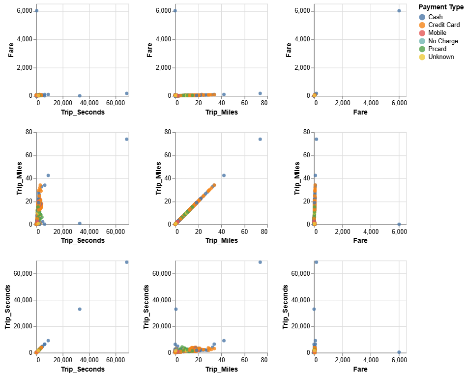

# Visualization and Analysis using GeoPandas and Altair

This project involves data visualization and analysis using GeoPandas and Altair to explore taxi trip data in Chicago. It creates interactive heatmaps with brush selection functionality, allowing users to explore geographical data by filtering data points interactively. The following tasks are implemented:

## Pre-Requisites
To use this project, install the required dependencies, download the datasets (Taxi_Trips.csv and chicago.geojson), and run the code in a Jupyter Notebook or your preferred Python IDE.

Before running the code, install the required libraries using the following command:
~~~bash
pip install geopandas altair pandas jupyter
~~~

Download the datasets required to do the tasks:

[Taxi Trips Dataset](Datasets/Taxi_Trips.rar)

[Chicago ZIP Code Boundaries Dataset](Datasets/chicago.geojson)

## Task 1: Data Preparation
Import the necessary libraries and load the data:
~~~bash
import pandas as pd
import geopandas as gpd
import altair as alt
from shapely.geometry import Point
~~~
~~~bash
df = pd.read_csv('data/Taxi_Trips.csv')
geometry = [Point(xy) for xy in zip(df['Pickup Centroid Longitude'], df['Pickup Centroid Latitude'])]
gdf = gpd.GeoDataFrame(df, geometry=geometry, crs=4326).sample(1000)
gdf = gdf.rename(columns={"Trip Seconds": "Trip_Seconds", "Trip Miles": "Trip_Miles"})
~~~

Note that we are renaming certain columns to remove white spaces. To display the first few rows:
~~~bash
gdf.head()
~~~

## Task 2: Data Joining and Cleaning
Load the Chicago ZIP code boundaries dataset:
~~~bash
chicago = gpd.read_file('data/chicago.geojson')
~~~

Perform a spatial join between taxi trip data and Chicago ZIP codes to aggregate fare data by ZIP code:
~~~bash
joined = gpd.sjoin(gdf, chicago, predicate='within')
joined['Fare'] = pd.to_numeric(joined['Fare'], errors='coerce')
joined = joined[['zip', 'Fare']]
joined = joined.groupby('zip', as_index=False).mean()

print(joined.isna().sum())
~~~

Merge the aggregated data back with the Chicago ZIP code boundaries:
~~~bash
merged = chicago.merge(joined, on='zip')
~~~

## Task 3: Creating Linked Views
Create a basic linked view with scatter plots using Altair:
~~~bash
brush = alt.selection_interval()

matrix = alt.Chart(gdf).mark_circle().add_params(brush).encode(
    alt.X(alt.repeat("column"), type='quantitative'),
    alt.Y(alt.repeat("row"), type='quantitative'),
    color=alt.condition(brush, 'Payment Type:N', alt.value('grey')),
    opacity=alt.condition(brush, alt.value(0.8), alt.value(0.1))
).properties(
    width=150,
    height=150
).repeat(
    row=['Fare', 'Trip_Miles', 'Trip_Seconds'],
    column=['Trip_Seconds', 'Trip_Miles', 'Fare']
)

matrix
~~~

    

## Task 4: Interactive Heatmap Visualization Matrix
Heatmaps are created to visualize trip metrics (Trip_Seconds, Trip_Miles, and Fare) geographically using longitude and latitude.

### **Code 1: Heatmaps for Individual Metrics**

The following heatmaps visualize individual metrics over geographic locations:
- Trip Seconds
- Trip Miles
- Fare

Each heatmap utilizes:
- Binned Longitude and Latitude for grouping data into grid cells.
- Color intensity to represent the selected metric values.
- Brushing to allow interactive filtering across multiple heatmaps.

A selection interval is defined to allow brushing, which highlights selected data points.
~~~bash
brush = alt.selection_interval()
~~~
**Heatmap for Trip_Seconds**

This heatmap visualizes trip duration data by color intensity.
~~~bash
heatmap_trip_seconds = alt.Chart(gdf).mark_rect().encode(
    x=alt.X('Pickup Centroid Longitude', bin=alt.Bin(maxbins=30)),
    y=alt.Y('Pickup Centroid Latitude', bin=alt.Bin(maxbins=30)),
    color=alt.Color('Trip_Seconds', scale=alt.Scale(scheme='reds')),
    opacity=alt.condition(brush, alt.value(1), alt.value(0.1))
).add_params(brush)
~~~
**Heatmap for Trip_Miles**

This heatmap visualizes the trip distances by color intensity.
~~~bash
heatmap_trip_miles = alt.Chart(gdf).mark_rect().encode(
    x=alt.X('Pickup Centroid Longitude', bin=alt.Bin(maxbins=30)),
    y=alt.Y('Pickup Centroid Latitude', bin=alt.Bin(maxbins=30)),
    color=alt.Color('Trip_Miles', scale=alt.Scale(scheme='blues')),
    opacity=alt.condition(brush, alt.value(1), alt.value(0.1))
).add_params(brush)
~~~
**Heatmap for Fare**

This heatmap visualizes fare amounts by color intensity.
~~~bash
heatmap_fare = alt.Chart(gdf).mark_rect().encode(
    x=alt.X('Pickup Centroid Longitude', bin=alt.Bin(maxbins=30)),
    y=alt.Y('Pickup Centroid Latitude', bin=alt.Bin(maxbins=30)),
    color=alt.Color('Fare', scale=alt.Scale(scheme='greens')),
    opacity=alt.condition(brush, alt.value(1), alt.value(0.1))
).add_params(brush)
~~~
**Combining Heatmaps**

The three heatmaps are combined into a single visualization for side-by-side comparison.
~~~bash
heatmap_trip_seconds & heatmap_trip_miles & heatmap_fare
~~~

  

### **Code 2: Combined Heatmap with Repeated Variables**

This visualization uses Altair's repeat feature to efficiently create a grid of heatmaps comparing each metric against the others.

A selection interval is defined to allow brushing, which highlights selected data points.
~~~bash
brush = alt.selection_interval()
~~~
**Heatmap with Repeated Variables**

This heatmap visualizes multiple metrics by placing variables in both rows and columns.
~~~bash
heatmap = alt.Chart(gdf).mark_rect().encode(
    alt.X(alt.repeat("column"), bin=alt.Bin(maxbins=30)),
    alt.Y(alt.repeat("row"), bin=alt.Bin(maxbins=30)),
    color=alt.Color(alt.repeat("column"), scale=alt.Scale(scheme='reds')),
    opacity=alt.condition(brush, alt.value(1), alt.value(0.1))
).add_params(brush).properties(
    width=150,
    height=150
).repeat(
    row=['Fare', 'Trip_Miles', 'Trip_Seconds'],
    column=['Trip_Seconds', 'Trip_Miles', 'Fare']
)

heatmap
~~~

**Combining Heatmaps**
This configuration allows users to compare metrics directly by aligning them in a grid pattern. The brush selection enhances interactivity, making it easier to explore specific data points.

    

